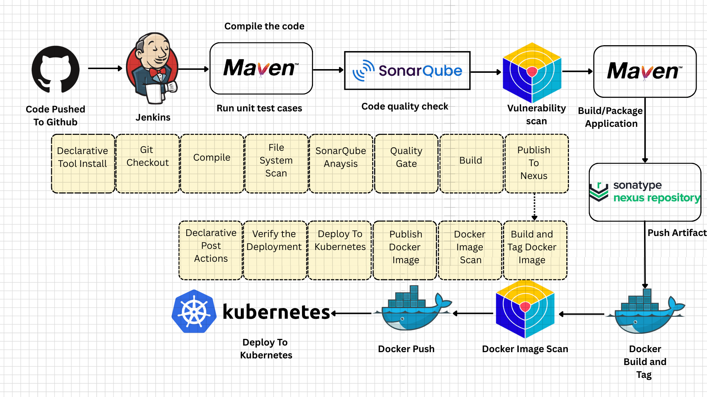
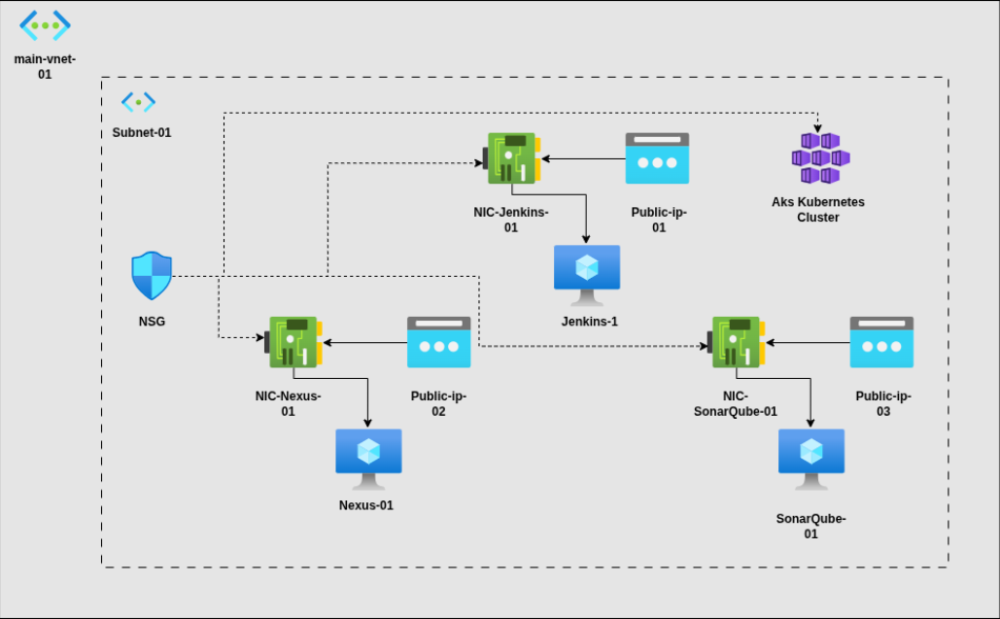

# Cloud-Native DevOps CI/CD Pipeline with Infrastructure Automation

**Project Name Recommendation:** `CloudGate DevOps` or `AutoDeploy Platform`

> A production-grade, enterprise-ready CI/CD pipeline demonstrating end-to-end DevOps practices: automated code quality scanning, container orchestration, and infrastructure-as-code on Azure.

---

## Project Overview

This project showcases a **fully automated DevOps ecosystem** that covers the complete software delivery lifecycle:

- **Source Control** → Code push triggers automated pipeline
- **Build & Test** → Compile, unit test, SonarQube quality gates
- **Security Scanning** → Trivy filesystem and container image scanning
- **Artifact Management** → Publish artifacts to Nexus repository
- **Containerization** → Docker build and push to registry
- **Orchestration** → Deploy to Kubernetes with role-based access control
- **Infrastructure** → Azure cloud provisioning with Terraform

**Target Audience:** DevOps engineers, Cloud architects, SREs, and platform engineering teams.

---

## Architecture

### CI/CD Pipeline Flow

This diagram illustrates the complete pipeline workflow from code push to Kubernetes deployment:



**Pipeline Stages:**
1. **Code Push** → GitHub webhook triggers Jenkins
2. **Git Checkout** → Clone repository with credentials
3. **Compile** → Maven compiles Java source code
4. **Unit Tests** → Maven runs JUnit tests
5. **File System Scan** → Trivy scans source code for vulnerabilities
6. **SonarQube Analysis** → Static code analysis for bugs, code smells, coverage
7. **Quality Gate** → Enforces code quality standards (aborts if failed)
8. **Publish to Nexus** → Maven publishes JAR to Nexus repository
9. **Docker Build & Tag** → Builds container image with build number
10. **Docker Image Scan** → Trivy scans container image for vulnerabilities
11. **Docker Push** → Authenticates with Docker Hub and pushes images
12. **Deploy to Kubernetes** → Applies deployment manifests
13. **Verify Deployment** → Confirms pod health and service endpoints

---

### Azure Cloud Architecture

This diagram shows the infrastructure provisioned on Microsoft Azure:



**Infrastructure Components:**
- **Resource Group** (`CICD-rg`) — Logical container for all resources
- **Virtual Network** (`Main-Vnet`) — Network isolation (CIDR: 10.0.0.0/16)
- **Subnet** (`Subnet-01`) — Subnet for resources (CIDR: 10.0.2.0/24)
- **Network Security Group (NSG)** — Firewall rules for inbound/outbound traffic
- **Public IPs** (Standard SKU) — Provides external access to VMs
- **3 Virtual Machines** (2 vCPU, 8GB RAM each):
  - **Jenkins-01** — CI/CD orchestration engine
  - **SonarQube-01** — Code quality and security scanning
  - **Nexus-01** — Artifact repository for Maven builds
- **AKS Kubernetes Cluster** — Container orchestration for deployments
- **Network Interfaces (NICs)** — Connectivity for each VM

---

## Tech Stack

| Layer | Technology | Version |
|-------|-----------|---------|
| **Source Control** | Git/GitHub | - |
| **CI/CD Orchestration** | Jenkins | Latest |
| **Build Tool** | Maven | 3.x |
| **Code Quality** | SonarQube | Latest |
| **Security Scanning** | Trivy | Latest |
| **Artifact Repository** | Nexus | 3.x |
| **Containerization** | Docker | Latest |
| **Container Registry** | Docker Hub | - |
| **Orchestration** | Kubernetes | 1.x+ |
| **Infrastructure** | Terraform | ~3.0.2 |
| **Cloud Provider** | Microsoft Azure | - |
| **Language** | Java 17 | Spring Boot 2.5.6 |
| **Database** | H2 (in-memory) | - |
| **Web Framework** | Spring Boot + Thymeleaf | 2.5.6 |

---

## Project Structure

```
CICD_Pipeline/
├── .gitignore                     # Git ignore rules (Terraform, Maven, Docker, etc.)
├── README.md                      # This file
│
├── Boardgames/                    # Spring Boot Application
│   ├── pom.xml                    # Maven dependencies
│   ├── Dockerfile                 # Container image definition
│   ├── Jenkinsfile                # Original Jenkins pipeline
│   ├── deployment-service.yaml    # K8s deployment & service
│   └── src/
│       ├── main/
│       │   ├── java/              # Java application code
│       │   └── resources/         # Config, schema, templates, static assets
│       └── test/                  # Unit tests
│
├── jenkins/
│   └── test.jenkinsfile           # Production CI/CD pipeline
│                                  # Stages:
│                                  # - Git checkout
│                                  # - Compile & Test
│                                  # - Trivy filesystem scan
│                                  # - SonarQube analysis & quality gate
│                                  # - Nexus artifact publish
│                                  # - Docker build, scan, push
│                                  # - K8s deployment & verification
│
├── kubernetes/
│   ├── svc.yaml                   # ServiceAccount for Jenkins
│   ├── sec.yaml                   # Secret (service account token)
│   ├── role.yaml                  # ClusterRole for permissions
│   └── bind.yaml                  # ClusterRoleBinding
│
└── Project_Infra/                 # Terraform Infrastructure-as-Code
    ├── main.tf                    # Root module orchestration
    ├── variables.tf               # Input variables
    ├── outputs.tf                 # Output values
    ├── terraform.tfvars           # Terraform variable values
    ├── terraform.tfstate          # State file (local; use remote backend for prod)
    └── modules/
        ├── resource_group/        # Azure Resource Group module
        │   ├── main.tf
        │   ├── variables.tf
        │   └── outputs.tf
        ├── network/               # Azure VNet & Subnets module
        │   ├── main.tf
        │   ├── variables.tf
        │   └── outputs.tf
        └── compute/               # Azure VMs (Jenkins, SonarQube, Nexus) module
            ├── main.tf
            ├── variables.tf
            └── outputs.tf
```

---

## Quick Start

### Prerequisites

- **Git** (for cloning)
- **Docker** & **Docker Compose** (for local testing)
- **kubectl** (for Kubernetes interaction)
- **Terraform** 1.1.0+ (for infrastructure)
- **Maven 3.x** (for building the app)
- **Azure CLI** (if deploying to Azure)
- **Jenkins** (can be deployed via Terraform)
- **Kubernetes cluster** (minikube, AKS, or equivalent)

### 1. Clone Repository

```bash
git clone https://github.com/Amogh052003/CICD_Pipeline.git
cd CICD_Pipeline
```

### 2. Deploy Infrastructure (Terraform)

```bash
cd Project_Infra

# Initialize Terraform
terraform init

# Review planned infrastructure
terraform plan

# Deploy to Azure
terraform apply -auto-approve
```

**What gets provisioned:**
- Azure Resource Group (`CICD-rg`)
- Virtual Network (`Main-Vnet` with CIDR `10.0.0.0/16`)
- Subnet (`Subnet-1` with CIDR `10.0.2.0/24`)
- Three Azure VMs (2 vCPU, 8GB RAM each):
  - `VM-Jenkins-1` (Build orchestration)
  - `VM-SonarQube-1` (Code quality)
  - `VM-Nexus-1` (Artifact repository)
- Public IPs (Standard SKU) for each VM

### 3. Set Up Kubernetes Cluster

```bash
# If using minikube
minikube start

# Apply Kubernetes manifests
kubectl apply -f kubernetes/svc.yaml    # ServiceAccount
kubectl apply -f kubernetes/sec.yaml    # Secret (token)
kubectl apply -f kubernetes/role.yaml   # ClusterRole
kubectl apply -f kubernetes/bind.yaml   # RoleBinding

# Verify
kubectl get sa -n webapps
kubectl describe secret mysecretname -n webapps
```

### 4. Configure Jenkins

1. SSH into Jenkins VM
2. Install Jenkins, Maven, Docker, SonarQube Scanner, Trivy
3. Add credentials in Jenkins:
   - `git-cred` — GitHub credentials
   - `sonar-token` — SonarQube token
   - `docker-cred` — Docker Hub credentials
   - `k8-cred` — Kubernetes kubeconfig
4. Create a new Pipeline job and point to `jenkins/test.jenkinsfile`

### 5. Build & Deploy Application

```bash
# Manually trigger Jenkins pipeline or push to main branch
# Pipeline will:
# 1. Compile and test the Boardgames application
# 2. Scan for vulnerabilities (filesystem + container)
# 3. Run SonarQube analysis
# 4. Publish artifacts to Nexus
# 5. Build Docker image and push to registry
# 6. Deploy to Kubernetes
# 7. Verify deployment

# Monitor deployment
kubectl get pods -n webapps
kubectl get svc -n webapps
kubectl logs -f deployment/boardgames -n webapps
```

---

## Security & Best Practices

 **Code Quality:**
- SonarQube integration with quality gates
- Unit tests enforced in pipeline

 **Container Security:**
- Trivy scans for vulnerabilities before push
- Container image scanned post-build

 **Infrastructure Security:**
- Terraform modules for reusability
- Role-based access control (RBAC) in Kubernetes
- Service accounts with minimal permissions
- Secrets managed via Kubernetes Secret (production: use HashiCorp Vault)

 **Artifact Management:**
- Maven artifacts published to Nexus
- Docker images pushed to authenticated registry

 **Access Control:**
- Jenkins ServiceAccount with ClusterRole permissions
- Separate namespaces (webapps) for isolation

---

## Pipeline Stages

### Stage 1: Git Checkout
Clones the repository from GitHub using stored credentials.

### Stage 2: Compile & Test
```bash
mvn -B clean compile
mvn -B test
```

### Stage 3: File System Scan
Trivy scans for vulnerabilities in source code and dependencies.
```bash
trivy fs --format table -o trivy-fs-report.html .
```

### Stage 4: SonarQube Analysis
Static code analysis for bugs, code smells, and coverage.
```bash
sonar-scanner -Dsonar.projectKey=BoardGame \
              -Dsonar.projectName=BoardGame \
              -Dsonar.sources=src \
              -Dsonar.java.binaries=target
```

### Stage 5: Quality Gate
Pipeline aborts if quality gate fails (enforces code standards).

### Stage 6: Nexus Publish
Publishes compiled JAR to Nexus repository.
```bash
mvn -B deploy
```

### Stage 7: Docker Build & Tag
Builds container image and tags with build number.
```bash
docker build -t amoghlokhande/boardgame:${BUILD_NUMBER} .
docker tag amoghlokhande/boardgame:${BUILD_NUMBER} amoghlokhande/boardgame:latest
```

### Stage 8: Docker Scan
Trivy scans container image for vulnerabilities.

### Stage 9: Docker Push
Authenticates with Docker Hub and pushes images.

### Stage 10: Kubernetes Deploy
Applies Kubernetes manifests (deployment + service).
```bash
kubectl apply -f deployment-service.yaml
```

### Stage 11: Verify Deployment
Checks pod status and service endpoints.
```bash
kubectl get pods -n webapps
kubectl get svc -n webapps
```

---

## Configuration

### Environment Variables (Jenkins)

```groovy
SCANNER_HOME = tool 'SonarScanner'
IMAGE_NAME = "amoghlokhande/boardgame"
```

### Terraform Variables (`terraform.tfvars`)

```hcl
resource_group_name = "CICD-rg"
location             = "East US"
vnet_name            = "Main-Vnet"
vnet_address_space   = ["10.0.0.0/16"]
admin_username       = "amogh"
vm_jenkins           = "VM-Jenkins-1"
vm_sonarqube         = "VM-SonarQube-1"
vm_nexus             = "VM-Nexus-1"
```

### Kubernetes Namespace

All resources deployed to `webapps` namespace:
```bash
kubectl create namespace webapps
```

---

## Monitoring & Logs

### Jenkins Build Logs
Navigate to Jenkins dashboard → Job → Build Number → Console Output

### SonarQube Dashboard
Access at `http://<sonarqube-ip>:9000` (default credentials)

### Kubernetes Pod Logs
```bash
kubectl logs -f <pod-name> -n webapps
kubectl describe pod <pod-name> -n webapps
```

### Trivy Scan Reports
- Filesystem: `trivy-fs-report.html`
- Image: `trivy-image-report.html`

---

## CI/CD Workflow

```
Developer Push to Git
    ↓
GitHub Webhook Triggers Jenkins
    ↓
Jenkins Pulls Latest Code
    ↓
Build & Test (Maven)
    ↓
Security Scans (Trivy, SonarQube)
    ↓
Quality Gate Check
    ↓
Artifact Publish (Nexus)
    ↓
Docker Build & Scan
    ↓
Docker Push to Registry
    ↓
Kubernetes Deploy
    ↓
Verification & Status Report
    ↓
Pipeline Complete 
```

---
##  Getting Started

### **1️⃣ Clone the Repository**

```bash
git clone https://github.com/Amogh052003/CICD_Pipeline.git
cd CICD_Pipeline
```

### **2️⃣ Deploy Azure Infrastructure**

```bash
cd Project_Infra
terraform init
terraform plan
terraform apply -auto-approve
```

### **3️⃣ Apply Kubernetes Configurations**

```bash
kubectl apply -f kubernetes/
kubectl get pods -n webapps
```
---
This project demonstrates:

1. **DevOps Pipeline Design** — Multi-stage automated delivery
2. **Infrastructure as Code** — Terraform modules for Azure cloud
3. **Container Orchestration** — Kubernetes deployment & scaling
4. **Security Integration** — Vulnerability scanning at multiple layers
5. **Code Quality** — SonarQube analysis with quality gates
6. **Artifact Management** — Maven + Nexus for versioning
7. **RBAC & Secrets** — Kubernetes security best practices
8. **Git Workflows** — Branch management and CI/CD triggers

---

## Contributing

To extend this project:

1. Add environment-specific configs (dev, staging, prod)
2. Implement GitOps with ArgoCD
3. Add Prometheus + Grafana for monitoring
4. Integrate HashiCorp Vault for secrets management
5. Add multi-region Azure deployment
6. Implement Terraform remote backend (Azure Storage)

---

**Last Updated:** November 27, 2025
